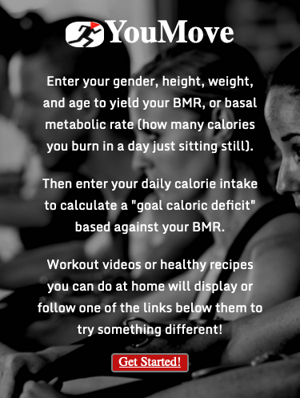
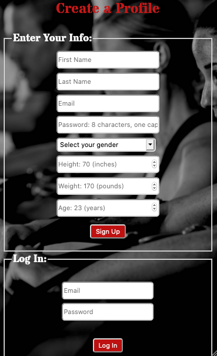
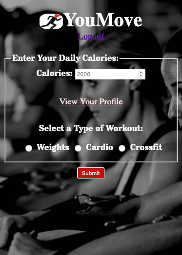
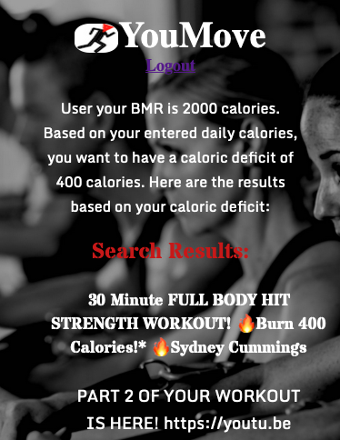

YouMove

Quarantine Weight? Wait...

    Enter your details and get results. Powered by the YouTube API and your  
    determination, access workout videos based on your basal metabolic rate  
    calculated against the calories you consumed in the past 24 hours. Select  
    a workout type (weights, cardio, or a combination of the two: crossfit)  
    and the app will provide you with a workout that will allow you to burn  
    off the amount of calories in excess of your BMR. The only way you lose  
    is by doing nothing. Your choice. YouMove.

Check out the app here!
    https://you-move-client-akjxxxxuu.vercel.app

Screenshots:

